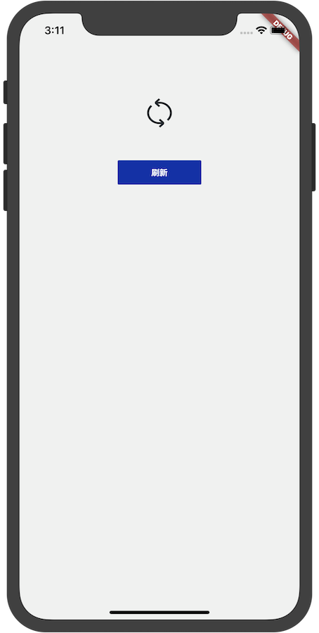
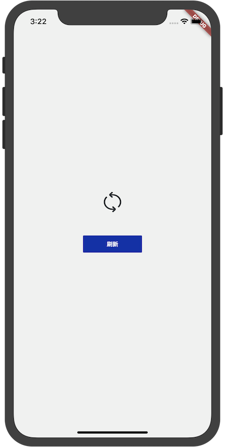
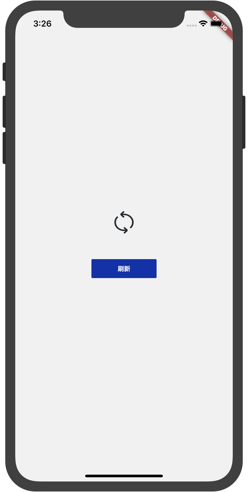

# FlutterSample

[中文版](./README-zh-CN.md)

## Usage

1. Clone respository to your local 

```
git clone https://github.com/nesger/FlutterSample.git
```

2. Import project to Android Studio  
3. Switch to the corresponding branch  
4. Switch directory to flutter module 

```
cd sub/my_flutter/
```

5. run 

```
flutter packages get
```

6. run

```
flutter run
```

## Branch

**feature/main_template**

main.dart route template

**feature/ui-refresh-one:**  
Direct layout



**feature/ui-refresh-two:**  
Two widget combinations：Expanded Widget + Column Widget



**feature/ui-refresh-three:**  
Column Widget + mainAxisAlignment attr


